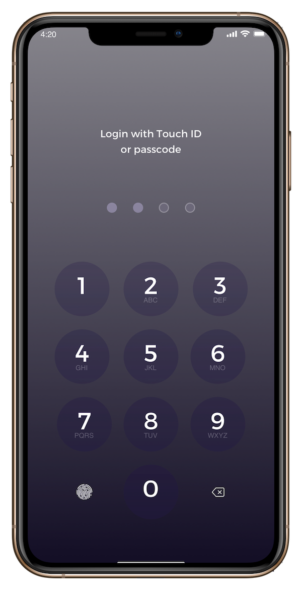
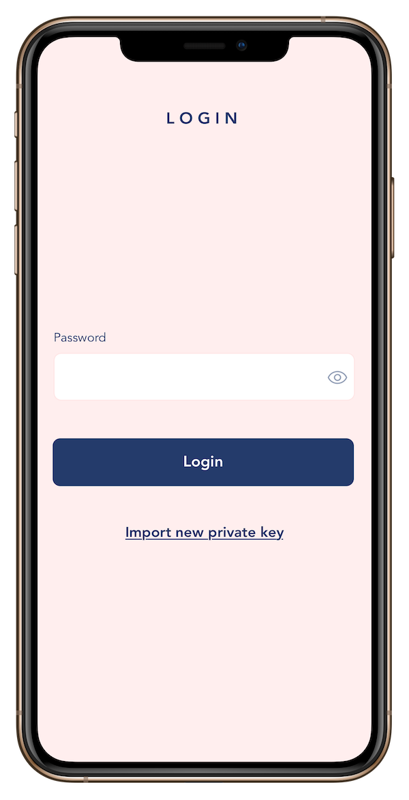
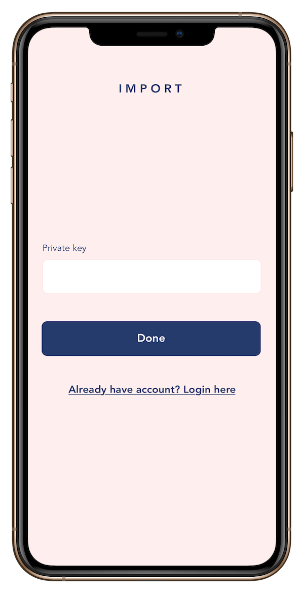
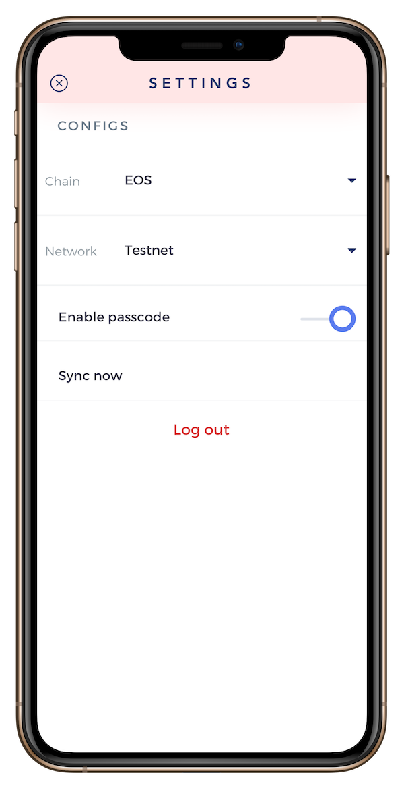

# blockpass

Password management in your hand. No server, all things are saved to EOS blockchain

### Show some :heart: and star the repo to support the project

### Screenshots

   

## Getting Started

For help getting started with Flutter, view [online documentation](https://flutter.dev/docs), which offers tutorials, 
samples, guidance on mobile development, and a full API reference.
